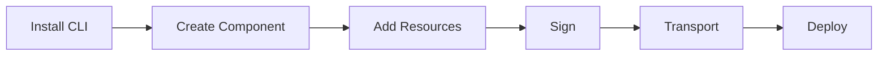

The Open Component Model (OCM) provides a standard way to describe and package software artifacts along with their metadata. This guide will walk you through the essential steps to start working with OCM.

## The OCM Workflow

## Guides











Start with [installing the OCM CLI](), then follow the guides in order to learn the complete workflow.

